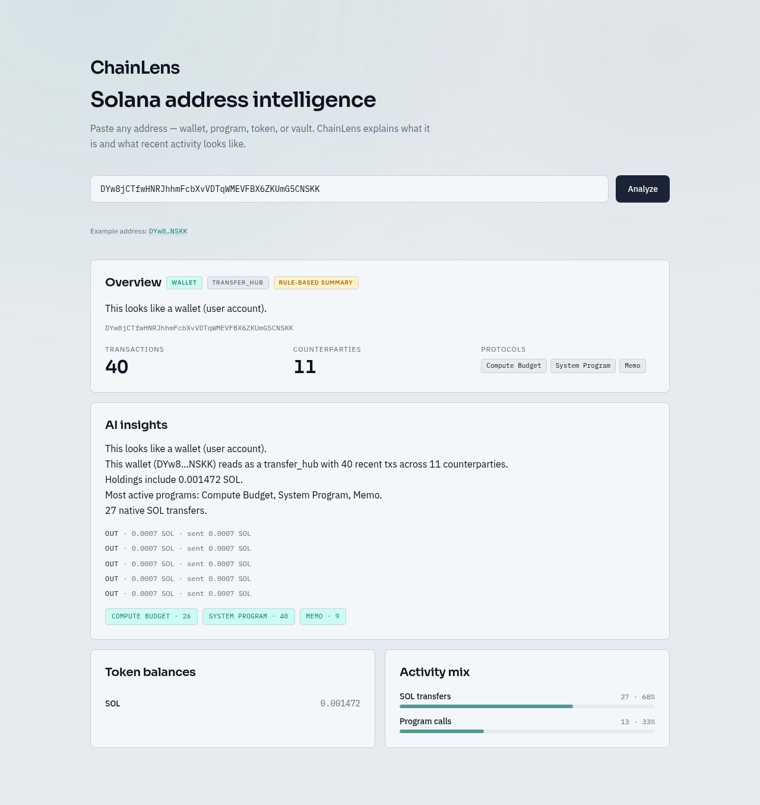

# ChainLens — AI-powered Solana wallet intelligence

[](https://github.com/Ah-Riz/chainlens/actions/workflows/ci.yml)

Portfolio MVP: Solana RPC → instruction parsing → LLM explanations → optional TiDB JSON cache.

**Live:** [Frontend](https://chainlens.ahmadmaulana.net) · [API `/health`](https://chainlens-fok6.onrender.com/health)

## Live URLs

| Surface | URL |
|---------|-----|
| Frontend (custom domain) | https://chainlens.ahmadmaulana.net |
| Frontend (Cloudflare Pages) | https://chainlens-8or.pages.dev |
| API (Render free Web Service) | https://chainlens-fok6.onrender.com |
| API health | https://chainlens-fok6.onrender.com/health |

Frontend build embeds the API base from GitHub variable `NEXT_PUBLIC_API_URL` (currently the Render URL above).

## Recruiter takeaway

> Understands Solana data, builds LLM product features, ships a full-stack MVP.

Honest framing: this is a **portfolio MVP**, not production SaaS. Render free tier **cold-starts ~30–60s** after idle.

## Try it

1. Optionally warm the API (avoids a cold first click): `./scripts/warmup.sh` or open [/health](https://chainlens-fok6.onrender.com/health).
2. Open https://chainlens.ahmadmaulana.net
3. Click the **Example address** link (`DYw8…NSKK`) → **Analyze**
4. Expect dashboard sections: **Overview**, **AI insights**, **Token balances**, **Activity mix** / transaction timeline



If the first request stalls, wait ~30–60s for Render wake-up, then retry. Warm-up:

```bash
./scripts/warmup.sh
# or: curl -fsS -m 90 https://chainlens-fok6.onrender.com/health
```

## Mock vs Gemini (honest)

| Mode | When | What you get |
|------|------|----------------|
| Rule-based | `MOCK_ANALYZE=true`, **or** missing/implausible `GEMINI_API_KEY` | Real Solana RPC fetch + rule-based narrative; UI badge **Rule-based summary** (`mock: true`) |
| Gemini | `MOCK_ANALYZE=false` **and** valid AI Studio key | Real RPC + Gemini structured summary; AI insights may show the model name |

- **CI** forces `MOCK_ANALYZE=true` so tests never call Gemini.
- **Production blueprint** ([`render.yaml`](render.yaml)) sets `MOCK_ANALYZE=false`; Gemini runs only when `GEMINI_API_KEY` is set on Render.
- Live demo may show the rule-based badge if the key is unset — on-chain data is still real.

## What it does

- Paste a Solana address (wallet, program, token, or vault)
- Fetch recent transactions via Solana JSON-RPC (`jsonParsed`)
- Decode SPL transfers and common program interactions
- Show activity mix, balances, and natural-language summaries
- Optionally cache analyses in TiDB Cloud when `DATABASE_URL` is set

## Architecture

See [docs/architecture.md](docs/architecture.md) and [docs/requirements.md](docs/requirements.md).

```
Wallet address
  → Solana RPC (signatures + txs + balances)
  → instruction decoder
  → Gemini structured summary (or rule-based fallback)
  → FastAPI (Render) → Next.js (Cloudflare Pages)
  → optional TiDB JSON cache
```

## Stack

| Layer | Choice |
|-------|--------|
| Frontend | Next.js (static export), TypeScript, Tailwind → Cloudflare Pages |
| Backend | Python, FastAPI → Render (free Web Service) |
| Chain | Solana JSON-RPC |
| AI | Google Gemini chat (+ rule-based fallback) |
| DB | TiDB Cloud (optional JSON cache) |
| Ops | GitHub Actions, Docker (API), pytest |

## Quick start (local)

```bash
cp .env.example .env
# Optional: DATABASE_URL (TiDB mysql+asyncmy://...?ssl=true)
# Optional: GEMINI_API_KEY, SOLANA_RPC_URL
# Offline / no Gemini: MOCK_ANALYZE=true

cd backend
python -m venv .venv && source .venv/bin/activate
pip install -r requirements.txt
uvicorn app.main:app --reload --port 8000

cd ../frontend
npm install
npm run dev
```

Open http://localhost:3000 — API docs at http://localhost:8000/docs

## Deploy

### Backend → Render (free)

1. Open [Render Dashboard](https://dashboard.render.com) → **New** → **Blueprint** → connect `Ah-Riz/chainlens`.
2. Apply [`render.yaml`](render.yaml) (service `chainlens-api`, Python, `rootDir: backend`, free plan).
   - If you already created a Web Service manually: set **Root Directory** to `backend`, build `pip install -r requirements.txt`, and **Start Command** to `uvicorn app.main:app --host 0.0.0.0 --port $PORT` (not the default `gunicorn your_application.wsgi`).
3. In the service **Environment**, set:
   - `DATABASE_URL` — optional TiDB `mysql+asyncmy://...?ssl=true`
   - `GEMINI_API_KEY` — required for live Gemini (AI Studio key, typically starts with `AIza`)
   - `GEMINI_MODEL` — optional; defaults to `gemini-3.8-flash`
   - Confirm `CORS_ORIGINS` includes `https://chainlens.ahmadmaulana.net`
4. Note the service URL (live: https://chainlens-fok6.onrender.com) and set GitHub `NEXT_PUBLIC_API_URL` to match.
5. Free tier **spins down when idle** — first request after idle can take ~30–60s. Use [`scripts/warmup.sh`](scripts/warmup.sh) before demos.

Auto-deploy on push to `main` is enabled in the Blueprint. Optional GitHub secret `RENDER_DEPLOY_HOOK` triggers an extra deploy from Actions.

### Frontend → Cloudflare Pages (GitHub Actions)

Push to `main` runs [`.github/workflows/ci.yml`](.github/workflows/ci.yml) and [`.github/workflows/deploy.yml`](.github/workflows/deploy.yml) (Pages + optional Render hook).

### GitHub Secrets

| Name | Purpose |
|------|---------|
| `CLOUDFLARE_API_TOKEN` | Pages deploy (Account → Cloudflare Pages → Edit) |
| `CLOUDFLARE_ACCOUNT_ID` | Cloudflare account id |
| `RENDER_DEPLOY_HOOK` | Optional; Render → Service → Settings → Deploy Hook |

### GitHub Variables

| Name | Value (this repo) |
|------|-------------------|
| `NEXT_PUBLIC_API_URL` | `https://chainlens-fok6.onrender.com` |

### Render environment (dashboard)

| Name | Notes |
|------|-------|
| `DATABASE_URL` | TiDB Cloud SQLAlchemy URL (optional) |
| `CORS_ORIGINS` | `https://chainlens.ahmadmaulana.net,https://chainlens-8or.pages.dev,http://localhost:3000` |
| `MOCK_ANALYZE` | Blueprint default `false`; set `true` only for demo without Gemini |
| `SOLANA_RPC_URL` | `https://api.mainnet-beta.solana.com` |
| `GEMINI_API_KEY` | AI Studio key (typically starts with `AIza`); omit → rule-based summary |
| `GEMINI_MODEL` | Optional; default `gemini-3.8-flash` |

### Custom domain DNS (`chainlens.ahmadmaulana.net`)

Cloudflare Pages → project **chainlens** → **Custom domains**. CNAME `chainlens` → `chainlens-8or.pages.dev` if DNS is external.

### Cloudflare Pages (Git-connected build)

Monorepo: Next app is under `frontend/`. Prefer **empty** Root directory and build via the repo root script (avoids missing `package-lock.json` at `/`).

| Setting | Value |
|---------|--------|
| **Root directory** | *(leave empty)* |
| **Framework preset** | None |
| **Build command** | `npm run pages:build` |
| **Build output directory** | `frontend/out` |
| **Env** `NEXT_PUBLIC_API_URL` | `https://chainlens-fok6.onrender.com` |

Alternative: Root directory `frontend`, build `npm ci && npm run build`, output `out`.

### First-time order

1. Create Render service from Blueprint; set env; wait until live.
2. Set GitHub `NEXT_PUBLIC_API_URL` to the Render HTTPS URL (Actions) **and/or** the same var in Pages → Settings → Environment variables.
3. Ensure Cloudflare Pages **Root directory** is `frontend` (or empty + `npm run pages:build`), then redeploy.
4. Optional: GitHub Actions Deploy with `CLOUDFLARE_*` secrets also publishes Pages via Wrangler.

## API

| Method | Path | Description |
|--------|------|-------------|
| GET | `/health` | Liveness |
| POST | `/analyze` | Full dashboard payload |

```bash
curl -s -X POST https://chainlens-fok6.onrender.com/analyze \
  -H 'Content-Type: application/json' \
  -d '{"address":"DYw8jCTfwHNRJhhmFcbXvVDTqWMEVFBX6ZKUmG5CNSKK"}'
```

## Tests

```bash
cd backend && pip install -r requirements-dev.txt && pytest
```

CI runs the same backend suite with `MOCK_ANALYZE=true` on every push/PR to `main`.

## Out of scope

- Multi-chain
- Full DEX IDL decoding
- Auth / rate limits / Redis
- Autonomous agents
- Wallet Adapter / vector similarity UI
- Failed-transaction debugger (keep this product as address/activity intelligence)
- Paid AWS App Runner hosting

## License

MIT — see [LICENSE](LICENSE)
