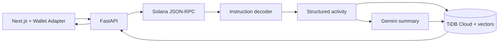

# ChainLens architecture

## Goal

Solana wallet intelligence: RPC → parse instructions → structured activity → LLM explanation → TiDB Cloud vector history.

## Pipeline

## Components

| Component | Responsibility |
|-----------|----------------|
| Frontend | Address input, Wallet Adapter, dashboard (Cloudflare Pages) |
| `POST /analyze` | Orchestrate fetch → parse → LLM → persist |
| Solana RPC client | Signatures, txs (`jsonParsed`), balances |
| Decoder | SPL transfers, program labels, activity events |
| LLM + embeddings | Narrative summary; vector store for similarity |
| TiDB Cloud | Cache analyses + txs; VECTOR cosine search |

## Deploy

| Layer | Host |
|-------|------|
| Frontend | Cloudflare Pages — https://chainlens.ahmadmaulana.net |
| API | Render free Web Service (`render.yaml`) |
| API (optional mock) | Cloudflare Worker |
| DB | TiDB Cloud Starter |

## Error handling

| Condition | Response |
|-----------|----------|
| Invalid address | 400 |
| RPC failure | 502 |
| Empty history | 200 + empty lists |
| Missing LLM key (live mode) | Rule-based summary + `mock: true` |

## Non-goals

Multi-chain, agents, Redis, Alembic, full DEX IDL decoding.
